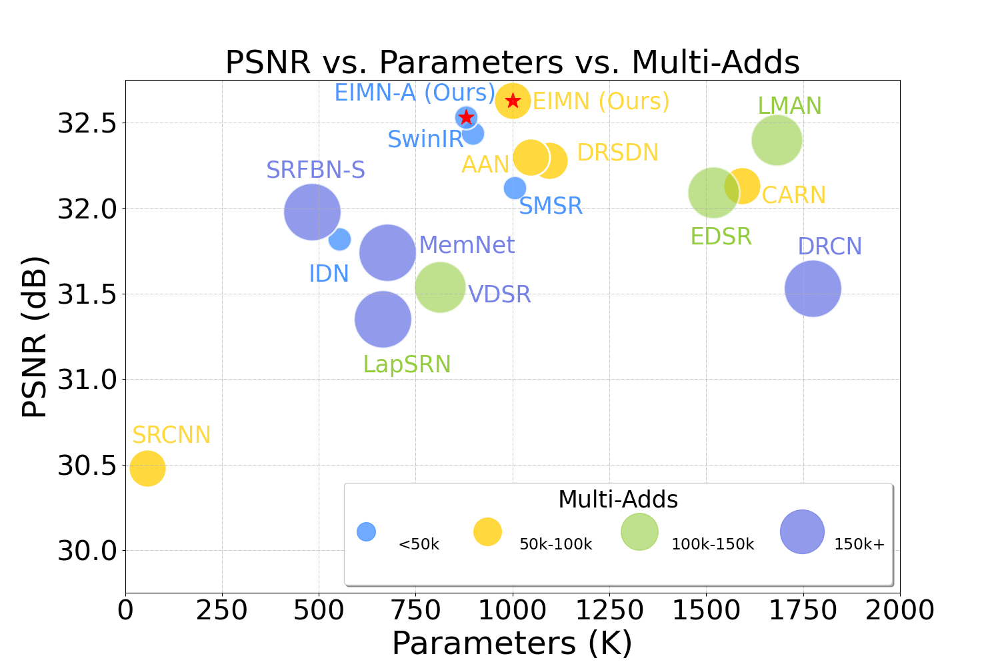
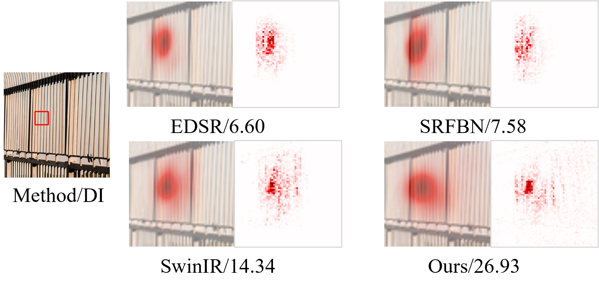
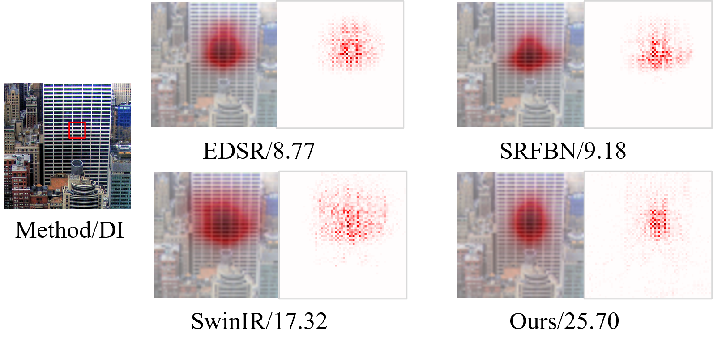
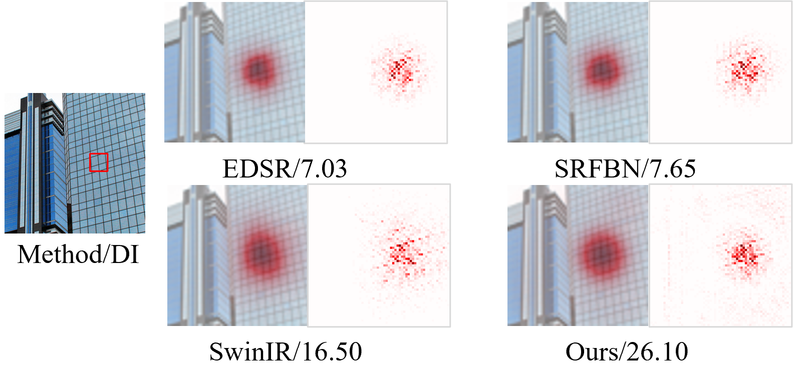

# [ECAI-2023] Efficient Information Modulation Network for Image Super-Resolution
Xiao Liu<sup>1 </sup>, Xiangyu Liao<sup>1 </sup>, Xiuya Shi<sup>1 </sup>, [Linbo Qing](https://scholar.google.com.hk/citations?hl=zh-CN&user=0KRDflwAAAAJ)<sup>1 </sup> and [Chao Ren](https://scholar.google.com.hk/citations?hl=zh-CN&user=Y6OuBMYAAAAJ)<sup>1, *</sup>

<sup>1</sup> Sichuan University,   <sup> *</sup> Corresponding Author

🤗 [paper](https://ebooks.iospress.nl/doi/10.3233/FAIA230435) 😀 [Supplementary materials](https://github.com/liux520/EIMN/blob/main/Docs/supplementary%20material.pdf)



<hr />

## :writing_hand: Changelog and ToDos
- [x] (2024/10/20) We migrate this project to the BasicSR framework and release more experimental weights. Move [here](https://github.com/liux520/EIMN_BasicSR).
- [x] (2023/08/20) Release training and evaluation code along with pre-trained models.
<hr />

## :bulb: Abstract


> **Abstract:** Recent researches have shown that the success of Transformers comes from their macro-level framework and advanced components, not just their self-attention (SA) mechanism. Comparable results can be obtained by replacing SA with spatial pooling, shifting, MLP, fourier transform and constant matrix, all of which have spatial information encoding capability like SA. In light of these findings, this work focuses on combining efficient spatial information encoding technology with superior macro architectures in Transformers. 
> We rethink spatial convolution to achieve more efficient encoding of spatial features and dynamic modulation value representations by convolutional modulation techniques. The large-kernel convolution and Hadamard product are utilizated in the proposed Multi-orders Long-range convolutional modulation (MOLRCM) layer to imitate the implementation of SA. Moreover, MOLRCM layer also achieve long-range correlations and self-adaptation behavior, similar to SA, with linear complexity. On the other hand, we also address the sub-optimality of vanilla feed-forward networks (FFN) by introducing spatial awareness and locality, improving feature diversity, and regulating information flow between layers in the proposed Spatial Awareness Dynamic Feature Flow Modulation (SADFFM) layer. Experiment results show that our proposed efficient information modulation network (EIMN) performs better both quantitatively and qualitatively.
<hr />

## :sparkles: Synthetic Image SISR Results
<details>
	<summary><strong>Quantitative Comparison with SOTA</strong> (click to expand) </summary>
    <p></p>
	Quantitative comparison with SOTA methods on five popular benchmark datasets. Blue text indicates the best results. `Multi-Adds' is calculated with a 1280 $\times$ 720 HR image.
</details>
<details>
	<summary><strong>Qualitative Comparison with SOTA</strong> (click to expand) </summary>
    <p></p>
    <p></p>
    <p></p>
    <p></p>
    <p></p>
    <p></p>
    <p></p>
    <p></p>
    <p></p>
</details>
<details>
	<summary><strong>LAM visualization analysis</strong> (click to expand) </summary>
	<p></p>
    <p></p>
    <p></p>
	Results of Local Attribution Maps. A more widely distributed red area and higher DI represent a larger range pixels utilization. 
</details>


<hr />

## :rocket: Installation

This repository is built in PyTorch 1.12.1 and trained on Centos 4.18.0 environment (Python3.7, CUDA11.6, cuDNN8.0). 

1. Clone our repository
```
git clone https://github.com/liux520/EIMN.git
cd EIMN
```
<hr />

## :computer: Usage

### 0. Dataset Preparation

- The dataset for training can be downloaded here [DIV2K](https://data.vision.ee.ethz.ch/cvl/DIV2K/) and [Flickr2K](https://cv.snu.ac.kr/research/EDSR/Flickr2K.tar).

- The dataset for testing can be downloaded here [BasicSR.](https://drive.google.com/drive/folders/1B3DJGQKB6eNdwuQIhdskA64qUuVKLZ9u)

- It is recommended to symlink the dataset root to `Datasets` with the follow command:

  For Linux: `ln -s [Your Dataset Path] [EIMN Project Path/Datasets]` 

  For Windows: `mklink /d [EIMN Project Path\Datasets] [Your Dataset Path]`   (In administrator mode)

- The file structure is as follows:

  ```
  Data
  Datasets
  ├─Benchmark   
  │  ├─Set5
  │  │  ├─GTmod12
  │  │  ├─LRbicx2
  │  │  ├─LRbicx3
  │  │  ├─LRbicx4
  │  │  └─original
  │  ├─Set14
  │  ├─BSDS100
  │  ├─Manga109
  │  └─Urban100
  ├─DF2K
  │  ├─DF2K_HR_train
  │  ├─DF2K_HR_train_x2m
  │  ├─DF2K_HR_train_x3m
  │  └─DF2K_HR_train_x4m  
  Demo
  ...
  ```

### 1. Evaluation
Download the pretrained weights here and run the following command for evaluation on five widely-used Benchmark datasets.
```
python Demo/inference.py 
```
If you just want to generate an image, you can run demo.py.
```
python Demo/demo.py 
```

### 2. Training

- Training the model **EIMN_L** with scale factor 2

```
CUDA_VISIBLE_DEVICES=0 python train_sr.py  --use_cuda --gpu_ids 0 --exp_name EIMN_L_x2 --train_batchsize 16 --val_batchsize 1 
--patch_size 128 128  --scale_factor 2 --workers 4 --dataset DF2K  --lr 0.0005 --lr_scheduler cos  --warmup_epochs 0 
--start_epoch 0 --epochs 1000 --model EIMN_L --epoch_eval 
```

- Finetuning the **EIMN_L** model with scale factor 3

```
CUDA_VISIBLE_DEVICES=0 python train.py --use_cuda --gpu_ids 0 --exp_name EIMN_L_x3 --train_batchsize 16 --val_batchsize 1 \
--patch_size 192 192 --scale_factor 3 --workers 4 --dataset DF2k --lr 0.0001 --lr_scheduler cos --warmup_epochs 0 
--start_epoch 0 --epochs 1000 --model EIMN_L --epoch_eval --resume [pretrained x2 model] --finetune
```

- Finetuning the **EIMN_L** model with scale factor 4

```
CUDA_VISIBLE_DEVICES=0 python train.py --use_cuda --gpu_ids 0 --exp_name EIMN_L_x4 --train_batchsize 16 --val_batchsize 1 \
--patch_size 256 256 --scale_factor 4 --workers 4 --dataset DF2k  --lr 0.0001 --lr_scheduler cos --warmup_epochs 0 
--start_epoch 0 --epochs 1000 --model EIMN_L --epoch_eval --resume [pretrained x3 model] --finetune
```

- Tips on the training or finetuning.

```
x2 scale: 
(a) HR patches of size 128 × 128 are randomly cropped from HR images. The mini-batch size and lr are set to 16 and 5e-4. This process repeats third. (The model is initialized with the pretrained weights, and trained with the same settings as the previous step.)
(b) The model is initialized with the pretrained weights obtained from (a). The parameters patch_size and lr are set to 128 x 128 and 1e-4. This process repeats second.  
(c) The model is initialized with the pretrained obtained weights from (b). The parameters patch_size and lr are set to 192 x 192 and 5e-5. This process repeats second.
```
```
x3 scale:
(a) The models for different SR scales (x2, x3, and x4) have identical structures, except for the tail module which consists of unique convolution and pixel shuffle layers. Consequently, when we have a pretrained x2 model, we can directly transfer its weights to the x3 and x4 models instead of training them from scratch. Since the tail modules are not shared, we initially fine-tune only the randomly initialized tail module while keeping the other layers frozen until convergence, which typically takes less than 1 hour. Subsequently, we fine-tune the entire model using a patch size of 288×288 and a lr of 1e-4.
(b) The same training settings are kept to train the model, except that the lr is set to 5e-5.
```
```
x4 scale:
(a) After loading the pre-training weights from the x3 scale, we proceed to finetune the entire model using a patch size of 384×384 and a lr of 1e-4.
(b) The same training settings are kept to train the model, except that the lr is set to 5e-5.
```

<hr />

## :arrow_double_down: Model Zoo

|          Model           | PSNR/SSIM | #Params | Multi-Adds |                            Checkpoint                             |
| :---------------------: | :---: | :-----: | :---: | :----------------------------------------------------------: |
|   EIMN_L_x2   | 38.26/0.9620 | 981K | 212G | EIMN_L_x2.pth |
| EIMN_L_x3 | 34.76/0.9304 | 990K | 95G | EIMN_L_x3.pth |
| EIMN_L_x4   | 32.63/0.9008 | 1002K | 54G | EIMN_L_x4.pth |
| EIMN_A_x2 | 38.26/0.9619 | 860K | 186G | EIMN_A_x2.pth |
| EIMN_A_x3 | 34.70/0.9299 | 868K | 83G | EIMN_A_x3.pth |
| EIMN_A_x4 | 32.53/0.8993 | 880K | 47G | EIMN_A_x4.pth |

<hr />

## :e-mail: Contact
Should you have any question, please create an issue on this repository or contact at liuxmail1220@gmail.com & liaoxiangyu1@stu.scu.edu.cn &shixiuya@stu.scu.edu.cn.

<hr />

## :heart: Acknowledgement
We thank the [XPixelGroup](https://github.com/XPixelGroup) for the excellent low-level vision framework [BasicSR](https://github.com/XPixelGroup/BasicSR).

<hr />

## :pushpin: License
This project is released under the [MIT license](LICENSE).

## :pray: Citation
If this work is helpful for you, please consider citing:

```
@incollection{EIMN,
  title={Efficient Information Modulation Network for Image Super-Resolution},
  author={Liu, Xiao and Liao, Xiangyu and Shi, Xiuya and Qing, Linbo and Ren, Chao},
  booktitle={26th European Conference on Artificial Intelligence (ECAI)},
  pages={1544--1551},
  year={2023},
  publisher={IOS Press}
}

```

